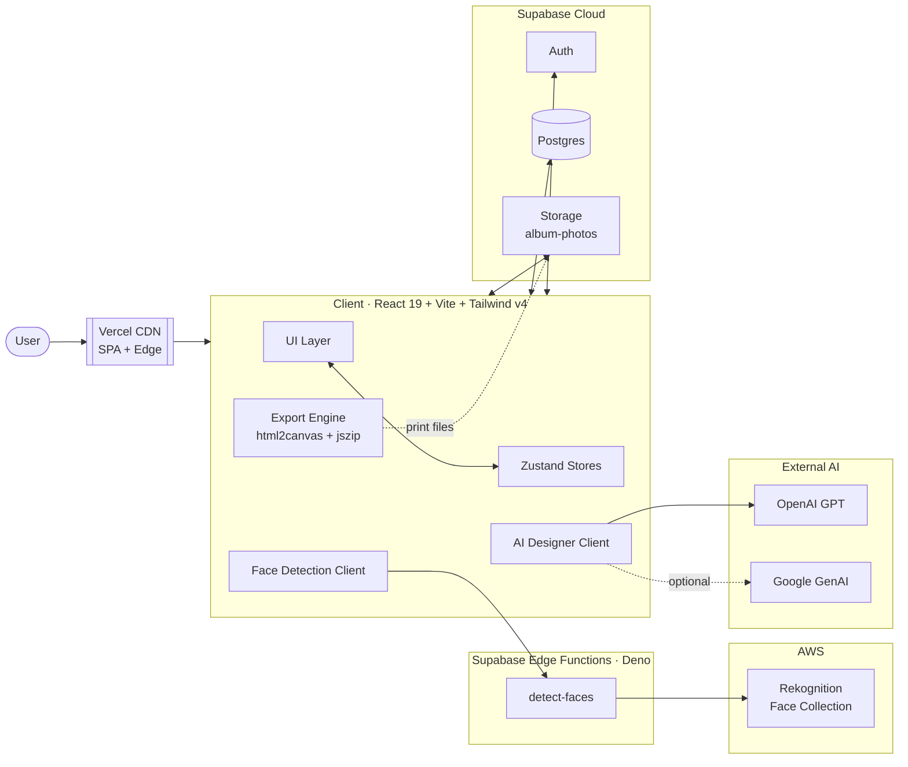

<!-- README: UTF-8, LF line endings (see .gitattributes; keeps raw.githubusercontent readable). -->
<div align="center">


<br /><br />


# Momento

### AI-Designed Premium Photo Albums

*An end-to-end web application that turns a folder of photos into a print-ready, hand-crafted-feeling photo album — designed by AI, polished by humans.*

<sub>אלבומי תמונות יוקרתיים, מעוצבים על ידי AI · ספר זיכרונות שמרגיש כתוב ביד</sub>

<br />

[](https://react.dev)
[](https://www.typescriptlang.org)
[](https://vitejs.dev)
[](https://tailwindcss.com)
[](https://supabase.com)
[](https://aws.amazon.com/rekognition/)
[](https://openai.com)
[](https://vercel.com)

<br />

**[Live Demo](#)** · **[Watch the Showcase](#showcase)** · **[Architecture](#system-architecture)** · **[AWS Stack](#aws-integration)**

<!-- TODO: replace the "Live Demo" link above with the production URL once deployed -->

</div>

---

## Showcase

<!--
  TODO — Embed product video here.
  Two options that both render natively on GitHub:

  1) Drag-and-drop the .mp4 directly into this README on github.com — GitHub will
     auto-upload it and swap the `` below for a `<video>` tag pointing at
     `user-images.githubusercontent.com`.

  2) Or commit a file (e.g. `public/video.mp4` already exists) and paste a link:

     https://user-images.githubusercontent.com/<id>/<hash>.mp4
-->

<div align="center">

<!-- Replace the line below with the uploaded video URL -->
<a href="#"></a>

<sub>A 60-second walkthrough — upload, curate, generate, edit, order.</sub>

</div>

---

## Why Momento

Building a beautiful photo album is hard. Choosing photos is hard, sequencing them is harder, and laying them out so a 40-page book *feels* like a single piece of art is harder still.

Momento collapses that work into ~10 minutes. It is a fully realized product that combines:

- **A real AI design system** — not a templated layout picker. The AI proposes a complete spread skeleton (photo slots, text blocks, decorations, palette, typography) within a strict, hand-built design grammar.
- **Production-grade face intelligence** — powered by **AWS Rekognition** for cross-photo identity clustering, so the editor can group photos by person and surface unplaced shots intelligently.
- **A premium, RTL-first experience** — designed in Hebrew with a 3D realistic page-flip editor, no-scroll product screens, and motion-design that earns its keep.
- **A complete commerce path** — auth, album persistence, exports, checkout, and order tracking, all wired through Supabase.

> **This is not a prototype.** Photos move through real Supabase Storage. Faces are indexed in a live AWS Rekognition collection. Spreads are generated by real OpenAI calls against a custom prompt grammar. Orders persist in Postgres. The product is in active production use.

---

## Highlights

- **AI Spread Designer** — A custom OpenAI-driven pipeline produces complete `AISpreadSpec` objects (positions, layers, typography, decorations) bound to a "Design Family" vocabulary, then validated and rendered as fully editable spreads.
- **AWS Rekognition Face Pipeline** — A Supabase Edge Function runs the AWS Rekognition SDK, performs `IndexFaces` + `SearchFaces`, and the client clusters identities with a Union-Find pass over the match graph. People appear as pickable chips throughout the editor.
- **3D Realistic Album Preview** — Built on `react-pageflip` with strict design constraints (see `.cursor/rules/pageflip-3d-constraint.mdc`) for a true book-like feel.
- **Print-ready Export** — Spread-by-spread bitmap export via `html2canvas` packed to a single ZIP via `jszip`, with bleed and safe-area awareness driven by the editor's margin model.
- **HEIC + EXIF aware** — iPhone HEIC decoding (`heic2any`) and orientation correction (`exifr`) so photos always render right.
- **Virtualized galleries** — `@tanstack/react-virtual` keeps thousands of thumbnails buttery-smooth.
- **Optimistic, instant UX** — Photos appear in the people-strip the moment they are uploaded; curate previews are full-resolution; the editor restores its state across reloads via Zustand persistence.
- **RTL-first** — The entire UI is Hebrew (`dir="rtl"`) with custom typography (Allura wordmark + Heebo + Plus Jakarta Sans).

---

## System Architecture



---

## AWS Integration

Momento uses **AWS Rekognition** as the production face-matching engine. The entire flow is server-side: the browser never holds AWS credentials.

**Why Rekognition.** It is the fastest path to ship cross-photo identity clustering with sub-second latency, high accuracy on faces in the wild, and a billing model that scales with usage rather than provisioning.

**The flow:**

1. The client base64-encodes uploaded photos and posts them to the **`detect-faces` Supabase Edge Function**.
2. The Edge Function authenticates with AWS via environment-bound credentials (`AWS_ACCESS_KEY_ID`, `AWS_SECRET_ACCESS_KEY`, `AWS_REGION`) and lazy-initializes a `RekognitionClient`.
3. It calls `IndexFaces` on the configured Rekognition Collection (default `albums-prod`), then `SearchFaces` on each indexed face to discover matches above a configurable similarity threshold (default `0.80`).
4. The response — face IDs, bounding boxes, confidence scores, and a match graph — is returned to the client.
5. The client runs a **Union-Find** pass over the match graph (`src/lib/faceDetection.ts`) to merge identities and compute pixel-space crops for each face thumbnail.
6. Identities surface throughout the app: people-strip on upload, person filters in curate, and the unplaced-photos panel in the editor.

**Operational details.**
- Collection lifecycle is managed by the function itself (`ensureCollection`, `purgeCollection`).
- Region defaults to `eu-west-1` and is overridable per deployment.
- Match threshold is tunable via env (`AWS_REKOGNITION_MATCH_THRESHOLD`).
- Failures degrade gracefully — clustering becomes "one face per photo" if Rekognition is unavailable, never blocking the album flow.

> The function lives at `supabase/functions/detect-faces/index.ts` and uses `@aws-sdk/client-rekognition` via `npm:` imports (Deno-native).

---

## Tech Stack

| Layer | Technology | Why |
|---|---|---|
| UI Framework | **React 19** + TypeScript 5.9 | Concurrent rendering, fine-grained Suspense for AI flows |
| Build | **Vite 8** | Sub-second HMR, esbuild + Rolldown, tiny prod bundles |
| Styling | **Tailwind CSS v4** | Token-driven design system, zero-runtime CSS |
| Motion | **Motion v12** (Framer Motion) | Choreographed page transitions and AI-stage animations |
| State | **Zustand v5** | Three slim stores: `albumStore`, `editorStore`, `uiStore` |
| Routing | **React Router v7** | SPA with `AnimatePresence`-powered transitions |
| Realistic Pageflip | **react-pageflip** | True 3D book preview, governed by a Cursor rule for consistency |
| Virtualization | **@tanstack/react-virtual** | Buttery thumbnails over thousands of photos |
| Photos | **heic2any** + **exifr** | iOS HEIC decode + EXIF orientation |
| Export | **html2canvas** + **jszip** | Spread-by-spread print export, single-file download |
| AI Design | **OpenAI** (GPT) + **Google GenAI** | Spread-spec generation + concept selection |
| Face ML | **AWS Rekognition** | Production-grade face indexing & search |
| Backend | **Supabase** (Postgres, Auth, Storage, Edge Functions) | One platform for data, auth, files, and serverless compute |
| Hosting | **Vercel** | Edge SPA delivery with zero-config CI |

---

## Application Flow

| Route | Screen | Role |
|---|---|---|
| `/` | Landing | Hero, video showcase, how-it-works, pricing, FAQ |
| `/upload` | Upload | Drag-and-drop, HEIC decode, EXIF correction, instant people-strip |
| `/curate` | Curate | Filter, person-cluster, full-resolution previews, scoring |
| `/setup` | Setup | Paginated AI preference questions with live preview |
| `/configure` | Configure | Design family selection, palette, typography preview |
| `/generating` | Generation | Five-stage AI pipeline visualization |
| `/editor` | Editor | 3D pageflip, spread canvas, sidebar tools, unplaced-photos panel |
| `/checkout` | Checkout | Order summary, shipping, payment |
| `/confirmation` | Confirmation | Order success + tracking handoff |
| `/dashboard` | Dashboard | User's albums and order history |

---

## AI Design Pipeline

The AI Designer in `src/lib/aiDesigner.ts` does not pick from a list of templates. It generates a complete spread design from scratch, every time, within a constrained vocabulary.

```
Photos + Album Config + Sequence Slot
            │
            ▼
   ┌─────────────────────┐
   │  Concept Picker     │  Choose mood pack + design family
   └──────────┬──────────┘
              ▼
   ┌─────────────────────┐
   │  AI Spread Designer │  Generate AISpreadSpec via OpenAI
   └──────────┬──────────┘
              ▼
   ┌─────────────────────┐
   │  Spec Validator     │  Reject invalid specs, repair where possible
   └──────────┬──────────┘
              ▼
   ┌─────────────────────┐
   │  Composition Builder│  Bind photos to slots via photoPlacer
   └──────────┬──────────┘
              ▼
   ┌─────────────────────┐
   │  Rhythm Orchestrator│  Sequence album-wide for visual variety
   └──────────┬──────────┘
              ▼
        Editable Spreads
```

The AI works inside a vocabulary of **design families** (palette, typography, decorations) and **layout primitives** (slot grammars), so output is always *art-directed* rather than algorithmic-looking.

---

## Project Structure

```
.
├── public/                       Static assets (logo, hero, showcase video)
├── src/
│   ├── screens/                  Route-level screens
│   ├── components/
│   │   ├── landing/              Marketing site
│   │   ├── upload/               Upload + people-strip
│   │   ├── setup/                AI preference flow
│   │   ├── editor/               Album editor surface
│   │   ├── checkout/             Commerce
│   │   ├── dashboard/            User dashboard
│   │   └── shared/               BrandLogo, Icon, Toast, Skeleton...
│   ├── lib/
│   │   ├── aiDesigner.ts         AI spread spec generation
│   │   ├── faceDetection.ts      Rekognition client + Union-Find clustering
│   │   ├── photoPlacer.ts        Slot binding + crop math
│   │   ├── photoScorer.ts        Photo quality + relevance scoring
│   │   ├── designFamilies.ts     Palette + typography vocabularies
│   │   ├── layoutGrammar.ts      Layout primitive constraints
│   │   ├── exportSpread.ts       Print-ready bitmap export
│   │   ├── orderService.ts       Order persistence
│   │   ├── albumService.ts       Album persistence
│   │   └── supabase.ts           Supabase client
│   ├── store/                    Zustand stores (album, editor, ui)
│   ├── types/                    Shared domain types
│   └── admin/                    Admin tools
├── supabase/
│   └── functions/
│       └── detect-faces/         AWS Rekognition Edge Function
└── .cursor/rules/                Cursor rules enforcing design constraints
```

**Scale:** ~104 TS/TSX files, ~30,000 lines of application code.

---

## Getting Started

### Prerequisites

- Node.js 20+
- npm 10+
- A Supabase project (free tier is fine)
- An AWS account with Rekognition enabled (for face features)
- An OpenAI API key (for the AI Designer)

### Install & run

```bash
npm install
npm run dev
```

Open <http://localhost:5173>.

### Environment

Create a `.env.local` in the repo root (this file is git-ignored):

```bash
# OpenAI — AI Spread Designer
VITE_OPENAI_API_KEY=sk-...

# Google GenAI — concept assistance (optional)
VITE_GEMINI_API_KEY=...

# Supabase — Auth, DB, Storage
VITE_SUPABASE_URL=https://<project>.supabase.co
VITE_SUPABASE_ANON_KEY=...
```

Server-side AWS credentials are configured **per Supabase Edge Function**, not on the client:

```bash
supabase secrets set AWS_REGION=eu-west-1
supabase secrets set AWS_ACCESS_KEY_ID=...
supabase secrets set AWS_SECRET_ACCESS_KEY=...
supabase secrets set AWS_REKOGNITION_COLLECTION_ID=albums-prod
supabase secrets set AWS_REKOGNITION_MATCH_THRESHOLD=80
```

### Scripts

| Script | Purpose |
|---|---|
| `npm run dev` | Local dev server |
| `npm run build` | Type-check (`tsc -b`) and production build |
| `npm run preview` | Serve the production build locally |
| `npm run lint` | ESLint with the React-hooks + react-refresh rule packs |

---

## Deployment

**Frontend** ships to **Vercel** with zero configuration — `npm run build` produces `dist/` and `vercel.json` handles SPA fallback.

**Edge Functions** ship to Supabase:

```bash
supabase functions deploy detect-faces
```

**Database & Storage** are managed via the Supabase dashboard. The app expects a `album-photos` storage bucket and standard Supabase Auth.

---

## Performance Engineering

A handful of decisions worth calling out, all measurable in production:

- **Instant photo perception** — Photos render from object-URL blobs in the people-strip the moment they hit the upload queue, then transition to Supabase Storage URLs after upload, so the perceived latency is zero.
- **Full-res previews on demand** — The curate grid shows full-resolution previews instead of low-res thumbnails for the active filter, eliminating the "is this really my photo?" friction.
- **Virtualized lists** — `@tanstack/react-virtual` over thumbnail grids prevents DOM blow-up.
- **Lazy AI clients** — OpenAI and Rekognition clients are constructed on first use, not at boot.
- **Per-album state hydration** — `editorStore` resets on album load, preventing stale margins, palettes, and undo stacks from leaking across albums.

---

## Gallery

<div align="center">


<sub>A sample spread generated by Momento — outdoor / nature design family.</sub>

</div>

<!-- TODO: drop in additional product screenshots into public/screenshots/ and reference them here -->

---

## Brand & Design System

- **Wordmark** — Allura "Momento." used consistently across landing, headers, and the editor.
- **Type scale** — Allura (display), Plus Jakarta Sans (UI), Heebo (Hebrew text).
- **Color** — Earth-toned palette with warm neutrals, calibrated per design-family.
- **Iconography** — Material Symbols Outlined, single weight, single size.
- **Motion language** — Soft springs, no bouncy easings. Page transitions are gentle cross-fades; the only "showy" animation is the AI generation stage.
- **No-scroll product screens** — Every screen except the landing page fits in a single viewport. This is enforced as a design contract.

---

## Roadmap

- [ ] Web-based PDF/JPEG print pipeline directly from the browser
- [ ] Multi-language support beyond Hebrew (i18n scaffolding in place)
- [ ] Collaborative editing via Supabase Realtime
- [ ] Native mobile companion (Expo)
- [ ] Stripe-powered checkout

---

## Author

Built and maintained by **Eliav Ben-Hamo**.

This repository is the public face of a working business — the codebase, the product decisions, the design system, and the operational AWS + Supabase stack are all real.

For inquiries, partnerships, or to see Momento running in production, use the live link above.

---

## License

All rights reserved © Momento.

The source is published for portfolio and review purposes. Please open an issue if you would like to discuss licensing or commercial use.
